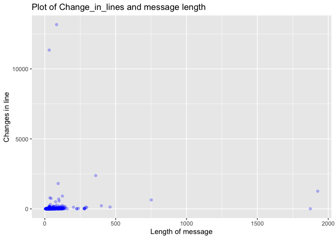
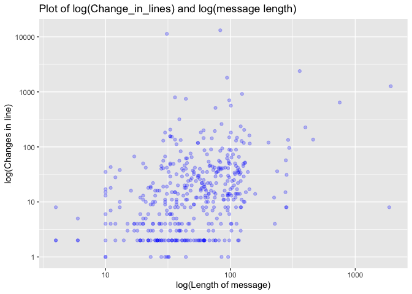

Untidy data
================
Stefanos Karageorgiou, Tianwei Liu, Manuel Gonzalez, Yilun Dong

## Setup - Load the data

## Lego Sales Data

``` r
sales <- readRDS("/Users/stefanoskarageorgiou/Desktop/lego_sales.rds")
```

### Part 1 - Tidying the data

Write up:

Part 1:<br /> We created a tidy data frame with the data cointained in
the file `lego_sales.rds`, which is a nested list. We used commands from
the package `dplyr` in order to map the variables in the list into
columns. The result was a tibble of 620 observations, one for each
purchase of a different Lego set made by a different costumer, and 16
columns. The first 6 columns correspond to variables from the costumer,
and the last 10 are variables from the purchase. We decided to leave the
variable `hobbies` as a list as we thought unnesting it would make the
tibble extremely large and uneasy to explore.

``` r
TS = 
  tibble(sales) %>%
  hoist(
    sales,
    gender = "gender",
    first_name = "first_name",
    last_name = "last_name",
    age = "age",
    phone_number = "phone_number",
    hobbies = "hobbies", 
    purchases = "purchases"
  ) %>%
  unnest_longer("purchases") %>%
  hoist(
    purchases,
    SetID = "SetID",
    Number = "Number",
    Theme = "Theme",
    Subtheme ="Subtheme",
    Year = "Year",
    Name = "Name",
    Pieces = "Pieces",
    USPrice = "USPrice", 
    ImageURL = "ImageURL", 
    Quantity = "Quantity"
    )
```

``` r
print(TS)
```

    ## # A tibble: 620 x 16
    ##    gender first_name last_name   age phone_number hobbies SetID Number Theme
    ##    <chr>  <chr>      <chr>     <dbl> <chr>        <list>  <int> <chr>  <chr>
    ##  1 Female Kimberly   Beckstead    24 216-555-2549 <chr [… 24701 76062  DC C…
    ##  2 Male   Neel       Garvin       35 819-555-3189 <chr [… 25626 70595  Ninj…
    ##  3 Male   Neel       Garvin       35 819-555-3189 <chr [… 24665 21031  Arch…
    ##  4 Female Chelsea    Bouchard     41 <NA>         <chr [… 24695 31048  Crea…
    ##  5 Female Chelsea    Bouchard     41 <NA>         <chr [… 25626 70595  Ninj…
    ##  6 Female Chelsea    Bouchard     41 <NA>         <chr [… 24721 10831  Duplo
    ##  7 Female Bryanna    Welsh        19 <NA>         <chr [… 24797 75138  Star…
    ##  8 Female Bryanna    Welsh        19 <NA>         <chr [… 24701 76062  DC C…
    ##  9 Male   Caleb      Garcia-W…    37 907-555-9236 <chr [… 24730 41115  Frie…
    ## 10 Male   Caleb      Garcia-W…    37 907-555-9236 <chr [… 25611 21127  Mine…
    ## # … with 610 more rows, and 7 more variables: Subtheme <chr>, Year <int>,
    ## #   Name <chr>, Pieces <int>, USPrice <dbl>, ImageURL <chr>, Quantity <dbl>

### Possible questions about data and appropriate answers:

1.  What are the three most common first names of purchasers?<br />
    Explanations:<br /> For this question, first we selected the
    variables `first_name` and `last_name`. We then selected the
    distinct rows, as they appeared one time for each purchase.
    Afterwards, we counted the appearances of every first name and then
    selected the top 5. As there where ties in the first and third
    possition, the result was a list of 7 names.

Comment 1:<br /> Jacob and Michael are the most common names, as they
appear four times each in the database. After those, there are five
names with three appearances.

``` r
TS %>%
  select(first_name,last_name)%>%
  distinct()%>%
  count(first_name) %>% 
  arrange(-n) %>%
  top_n(3,n) %>%
  print(n = Inf)
```

    ## # A tibble: 7 x 2
    ##   first_name     n
    ##   <chr>      <int>
    ## 1 Jacob          4
    ## 2 Michael        4
    ## 3 Amanda         3
    ## 4 Connor         3
    ## 5 Jackson        3
    ## 6 Joseph         3
    ## 7 Joshua         3

Comment 2:<br /> Here top\_n(3,n) will seek for the top 3 values of the
variable `n`, which corresponds to the number of times that a name
appears. In our case the maximum value of `n` is 4, but it occurres in 2
names. As a result, top\_n() will pledge 2 spots for those names,
leaving room for one more name. It is only logical that it will look for
names with the second highest frequency which are those with n=3, so it
will fill the remaining spot with the name correspoding to this value of
`n`. However there are 5 names with the same value, so top\_n(3,n) will
accept them all and will create extra spots for all of them. Thus,
top\_n(3,n) will result in 7 names. In the case where we want to observe
all the names with the 3 highest frequencies we would need a different
code, which is included as a comment below.

``` r
# TS %>%
#  select(first_name,last_name)%>%
#  distinct()%>%
#  count(first_name) %>%
#  arrange(-n) %>%
#  filter(dense_rank(-n)<=3)%>%
#  print(n = Inf)
```

2.  Which lego theme has made the most money for lego?<br />
    Explanations:<br /> In this problem, we used the variables
    `USPrice`, `Quantity`, and `Theme`. Then we created a new variable
    named `Revenue` by multiplying `USPrice` and `Quantity`. Afterwards,
    we group by `Theme`, and summed `Total_Revenue` for each group.

Comment:<br /> Here we can see that the theme with the highest revenue
is Star Wars with the total revenue of 4447.83 US Dollars for lego.

``` r
TS %>% 
  select(USPrice,Quantity,Theme) %>% 
  arrange(Theme) %>% 
  mutate(Revenue=Quantity*USPrice) %>%
  group_by(Theme) %>% 
  summarise(Total_Revenue=sum(Revenue)) %>%
  arrange(-Total_Revenue) %>%
  top_n(1,Total_Revenue) %>%
  print(n = Inf)
```

    ## # A tibble: 1 x 2
    ##   Theme     Total_Revenue
    ##   <chr>             <dbl>
    ## 1 Star Wars         4448.

3.  Do men or women buy more lego sets (per person) on average?<br />
    Explanations:<br /> Firstly, we selected the variables `first_name`,
    `last_name`, `gender` and `Quantity`. We then grouped by
    `first_name`, `last_name` and `gender` and summed over `Quantity` in
    order to obtain the total number of sets purchased by every
    costumer. Then we grouped by gender and obtained the average
    quantity for each group.

Comment:<br /> Altough the difference is very small, women buy on
average more Legos than man. Women buy 3.57 Legos per person on average,
as men buy 3.56.

``` r
TS %>%
  select(first_name,last_name,Quantity,gender) %>%
  group_by(first_name,last_name,gender) %>%
  summarise(TotalQuantity=sum(Quantity)) %>%
  group_by(gender) %>%
  summarise(avgquantity=mean(TotalQuantity))
```

    ## # A tibble: 2 x 2
    ##   gender avgquantity
    ##   <chr>        <dbl>
    ## 1 Female        3.57
    ## 2 Male          3.56

4.  What are the five most popular hobbies of lego purchasers?<br />
    Explanations:<br /> To tackle this problem, we selected
    `first_name`, `last_name`, and `hobbies`. In each row, `hobbies`
    remained as a list, so the next step was to unnest it. Afterwards,
    we selected the distinct values in order to obtain the different
    clients with their corresponding hobbies. Finally, we counted over
    the hobbies, and selected the top 5. Once again there were ties, so
    the result includes 12 hobbies.

Comment:<br /> We once again come across with a similar case of question
1. Here top\_n() will give us the 2 hobbies with the highest frequency
which is 6, then 2 with the second highest frequency. This leaves one
empty spot for the hobbie with the third highest frequency. As there are
8 observations with the same frequency, R included all of them. We used
the same approach as before. Hence, we included a relevant code below in
case we want to observe all the hobbies with the 5 highest frequencies,
that total 107.

``` r
  TS %>%
   select(first_name,last_name,hobbies) %>%
   unnest_longer(hobbies) %>%
   distinct() %>%
   filter(!is.na(hobbies)) %>%
   count(hobbies) %>%
   arrange(-n) %>%
   top_n(5,n) %>%
   print(n = Inf)
```

    ## # A tibble: 12 x 2
    ##    hobbies                 n
    ##    <chr>               <int>
    ##  1 Animal fancy            6
    ##  2 Skateboarding           6
    ##  3 Kitesurfing             5
    ##  4 Sculling or Rowing      5
    ##  5 Baseball                4
    ##  6 Bodybuilding            4
    ##  7 Gunsmithing             4
    ##  8 Herping                 4
    ##  9 Reading                 4
    ## 10 Seashell collecting     4
    ## 11 Topiary                 4
    ## 12 Volleyball              4

The table above shows that animal fancy and Skateboarding are the most
common hobbies, each one appearing 6 times. The second most popular ones
are Kitesurfing and Sculling or Rowing, with 4. Finally, there are 8
hobbies with four appearances.

If we wanted to obtain all the hobbies with the 5 highest number of
appearances, our solution will be as follows.

``` r
# TS %>%
#  select(first_name,last_name,hobbies) %>%
#  unnest_longer(hobbies) %>%
#  distinct() %>%
#  filter(!is.na(hobbies)) %>%
#  count(hobbies) %>%
#  arrange(-n) %>%
#  filter(dense_rank(-n)<=5) %>%
#  print(n = Inf)
```

5.  Which area code has spent the most money on legos?<br />
    Explanations:<br /> After selecting the relevant variables for this
    problem (USPrice, Quantity and phone\_number), the second task was
    to obtain the area code (the first three digits of the phone
    number), so we separated the phone number into three different parts
    and selected the first one. We also created a new variable named
    `Revenue` by multiplicating `Quantity` and `USPrice`. Afterwards, we
    grouped by area code and summed the revenues.

Comment:<br /> The area code 956, which corresponds to Laredo, TX, was
the one that spended the most on Legos.

``` r
TS %>%
  select(USPrice,Quantity,phone_number) %>%
  separate(phone_number,
           into=c("Area_Code","Phone_number_Part_2","Phone_number_Part_3"),
           sep="-") %>%
  select(Area_Code,USPrice,Quantity) %>%
  filter(!is.na(Area_Code)) %>%
  mutate(Revenue=USPrice*Quantity) %>%
  group_by(Area_Code) %>%
  summarise(total=sum(Revenue)) %>%
  arrange(-total) %>%
  top_n(1,total) %>%
  print(n = Inf)
```

    ## # A tibble: 1 x 2
    ##   Area_Code total
    ##   <chr>     <dbl>
    ## 1 956        720.

## GitHub dataset

``` r
commits = readRDS("dplyr_2019_commits.rds")
```

### Part 1 - Tidying the data

Write-up for part 1:<br /> In this sector, we created a data frame
called `df_commits` containing 6 columns, then printed out the first 10
rows of it. The columns in the data frame are listed as follows:<br />
`commit_sha` is the unique identifier of each commit.<br />
`author_name` is the login name (unique identifier) of each
author.<br /> `file_name` is the name with the full path of each file as
the unique identifier of files.<br /> `hour` is the time of each commit
in hours.<br /> `message` is the comment of each commit.<br />
`change_in_lines` is the total number of changes, namely addtions plus
deletions in the commit.<br />

To explain the creation process in detail, firstly we created the
initial data frame. Next, we unnested the column named `files` and put
different files from the same commit into different rows. We also
created a column called `file_name` when unnesting. Afterwards, we
modified `time` column to keep only the hour of commit and deleted
irrelevant time elements. Finally, we selected the 6 useful columns from
this data frame, printed the first 10 rows of it and proceeded to the
second part of the problem.

``` r
df_commits = 
          tibble(commits) %>%
          hoist(
            commits,
            commit_sha = "sha",
            author_name = c("author","login"),
            files = "files",
            time = c("commit", "author", "date"),
            message = c("commit", "message"),
            change_in_lines = c("stats", "total")
          ) %>%
          unnest_longer("files") %>%
          hoist(
            files,
            file_name = "filename"
          ) 
df_commits =   
  df_commits %>% separate(time,into=c("date","time"),sep='T') %>%
                  separate(time,into=c("hour","minute","second"),sep=":") %>%
  select(commit_sha, author_name, file_name, hour, message, change_in_lines)
```

``` r
print(df_commits)
```

    ## # A tibble: 1,348 x 6
    ##    commit_sha     author_name file_name     hour  message        change_in_lines
    ##    <chr>          <chr>       <chr>         <chr> <chr>                    <int>
    ##  1 77288767e663b… arcoutte    README.Rmd    12    Fix README dt…               4
    ##  2 77288767e663b… arcoutte    README.md     12    Fix README dt…               4
    ##  3 85faf79c1fd74… batpigandme DESCRIPTION   13    Use https for…               2
    ##  4 ceb74a67ea0d9… batpigandme DESCRIPTION   12    Use https for…               2
    ##  5 ec0949254dbbf… romainfran… NEWS.md       09    "Better perfo…              38
    ##  6 ec0949254dbbf… romainfran… inst/include… 09    "Better perfo…              38
    ##  7 ec0949254dbbf… romainfran… inst/include… 09    "Better perfo…              38
    ##  8 ec0949254dbbf… romainfran… src/init.cpp  09    "Better perfo…              38
    ##  9 ef1c4b9294228… hadley      README.Rmd    18    Add section o…              40
    ## 10 ef1c4b9294228… hadley      README.md     18    Add section o…              40
    ## # … with 1,338 more rows

### Part 2 - Questions

1.  Who are the top five contributors (in terms of the most commits) to
    dplyr in the last year?

Explanations to problem 1:<br /> In this problem, we firstly selected
`commit_sha` and `author_name` from `df_commits`. Then we used
`distinct()` to eliminate repeted `commit_sha` from the new data frame.
This is necessary because one commit could consist of multiple files
with the same `commit_sha` but different `file_name` were put into
different rows. Next, we counted the number of commits made by each
author and arranged the results in descending order. Finally, we applied
`top_n()` to include tied values.<br />

``` r
df_commits %>%
  select(commit_sha, author_name) %>%
  distinct() %>%
  group_by(author_name) %>%
  summarise(commits = n()) %>%
  arrange(-commits) %>%
  top_n(5, commits) %>%
  print(n = Inf)
```

    ## # A tibble: 5 x 2
    ##   author_name     commits
    ##   <chr>             <int>
    ## 1 romainfrancois      357
    ## 2 lionel-              14
    ## 3 hadley               13
    ## 4 yutannihilation       9
    ## 5 krlmlr                6

2.  Which four files have been modified in the most number of commits?

Explanations to problem 2:<br /> This problem is similar to the last
one. Firstly, we selected `file_name` from `df_commits`. Next, we
counted the appearances of each file and sorted the results in
descending order. Again, we used `top_n()` to include tied values at the
end.<br />

``` r
df_commits %>%
  select(file_name) %>%
  group_by(file_name) %>%
  summarise(times_of_modified=n()) %>%
  arrange(-times_of_modified) %>%
  top_n(4, times_of_modified) %>%
  print(n = Inf)
```

    ## # A tibble: 4 x 2
    ##   file_name                            times_of_modified
    ##   <chr>                                            <int>
    ## 1 NEWS.md                                             77
    ## 2 DESCRIPTION                                         53
    ## 3 R/funs.R                                            33
    ## 4 tests/testthat/test-colwise-mutate.R                32

3.  When is the most active time of the day for development on dplyr?
    More specifically, what is the average number of total changes made
    per commit for each hour of the day?

Explanations to problem 3:<br /> In this problem, we selected
`commit_sha`, `hour` and `change_in_lines` from `df_commits`. Then we
removed comments including ‘revdep’ and ‘Merge’, grouped the data by
hour, calculated the avegare numbers and put them in descending oreder.
The answer can be read directly from the output.<br />

``` r
df_commits %>%
  select(commit_sha,hour,change_in_lines, message) %>%
  distinct() %>%
  filter(grepl("revdep", message) == FALSE & grepl("Merge", message) == FALSE) %>%
  group_by(hour) %>%
  summarize(average_change_in_lines=mean(change_in_lines)) %>%
  arrange(-average_change_in_lines) %>%
  print(n = Inf)
```

    ## # A tibble: 24 x 2
    ##    hour  average_change_in_lines
    ##    <chr>                   <dbl>
    ##  1 12                      150. 
    ##  2 13                       55.0
    ##  3 09                       39.2
    ##  4 14                       38.6
    ##  5 16                       38.0
    ##  6 02                       34  
    ##  7 07                       29.7
    ##  8 08                       27.9
    ##  9 15                       26.7
    ## 10 11                       25.2
    ## 11 00                       23.5
    ## 12 22                       23.2
    ## 13 21                       21  
    ## 14 17                       19.4
    ## 15 04                       19  
    ## 16 10                       17.9
    ## 17 18                       16.4
    ## 18 05                       13.8
    ## 19 06                       11  
    ## 20 19                        8.8
    ## 21 03                        7.5
    ## 22 23                        6.5
    ## 23 01                        4  
    ## 24 20                        4

4.  Based on these data is there any “evidence” that commit message
    length is related to the complexity of the commit (as measured by
    the total number of changes in the commit)? Justify your answer.

Explanations to problem 4:<br /> To tackle this problem, we firstly
selected `commit_sha`, `message` and `change_in_lines` from `df_commits`
and created `df_4`. Then we used `distinct()` to delete repeated
`commit_sha`. The reason for doing this has been stated in the write up
for Problem 1. Afterwards, we applied two functions to examine the
corelation between length of `message` and number of `change_in_lines`.
The result from Pearson test illustrated that there was very little
evidence of linear relationship between these two variables. However,
Spearman test showed that there was some evidence that the relationship
between these two variables can be described by a monotonic, in this
case, increasing function. To have a better understanding of their
potential correalation, we also produced two plots. The first plot was
produced using the original scale of the two variables. The second one
was drawn after taking logrithm to base 10 of both of them. The two
plots also demostrated some weak positive correlation between the two
variables.<br />

``` r
df_4 = df_commits %>%
  select(commit_sha, message, change_in_lines) %>%
  distinct() %>%
  select(message, change_in_lines) 
  
  cor.test(nchar(df_4$message), df_4$change_in_lines, method = "pearson")
```

    ## 
    ##  Pearson's product-moment correlation
    ## 
    ## data:  nchar(df_4$message) and df_4$change_in_lines
    ## t = 1.3223, df = 431, p-value = 0.1868
    ## alternative hypothesis: true correlation is not equal to 0
    ## 95 percent confidence interval:
    ##  -0.03085963  0.15686042
    ## sample estimates:
    ##        cor 
    ## 0.06356261

``` r
  cor.test(nchar(df_4$message), df_4$change_in_lines, method = "spearman")
```

    ## Warning in cor.test.default(nchar(df_4$message), df_4$change_in_lines, method =
    ## "spearman"): Cannot compute exact p-value with ties

    ## 
    ##  Spearman's rank correlation rho
    ## 
    ## data:  nchar(df_4$message) and df_4$change_in_lines
    ## S = 8174669, p-value < 2.2e-16
    ## alternative hypothesis: true rho is not equal to 0
    ## sample estimates:
    ##       rho 
    ## 0.3958287

``` r
  ggplot(data = df_4) + geom_point(aes(x = nchar(message), y = change_in_lines), alpha = 0.25, color = "blue") + labs(x="Length of message",y="Changes in line")+ggtitle("Plot of Change_in_lines and message length")
```

<!-- -->

``` r
  ggplot(data = df_4 ) + geom_point(aes(x = nchar(message), y = change_in_lines), alpha = 0.25, color = "blue") + 
    scale_y_log10() + scale_x_log10() +labs(x="log(Length of message)",y="log(Changes in line)")+ggtitle("Plot of log(Change_in_lines) and log(message length)")
```

<!-- -->

5.  Other than Romain Francois, which three contributors have worked on
    the most different files in the repository? In order words, who has
    the greatest number of unique file names among their commits.

Explanation to problem 5:<br /> For this problem, we selected
`author_name` and `file_name` from `df_commits` at the beginning. Then
we used `distinct()` to remove repeated files. Next, we counted the
number of files each author worked on and excluded Romain Francois from
the name list. Finally, we used `top_n()` to include tide values and
derived the final results.<br />

``` r
df_commits %>%
  select(author_name, file_name) %>%
  distinct() %>%
  group_by(author_name) %>%
  summarise(number_of_files_worked_on=n()) %>%
  arrange(-number_of_files_worked_on) %>%
  filter(author_name != "romainfrancois") %>%
  top_n(3, number_of_files_worked_on) %>%
  print(n = Inf)
```

    ## # A tibble: 3 x 2
    ##   author_name     number_of_files_worked_on
    ##   <chr>                               <int>
    ## 1 Copepoda                               40
    ## 2 yutannihilation                        35
    ## 3 lionel-                                21
